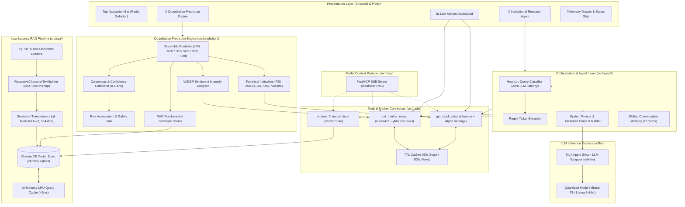

# Kinetic // Comprehensive Technical Architecture & System Report

> **Personal Investment Research Agent & Financial Intelligence Terminal**  
> **Platform Version:** v2.4-PRO  
> **Target Hardware Architecture:** Apple Silicon (macOS arm64 / MLX Accelerated)  
> **Primary Runtime:** Python 3.13  
> **Date of Report:** September 2026  

---

## Table of Contents

1. [Executive Summary & Project Purpose](#1-executive-summary--project-purpose)
2. [End-to-End System Architecture](#2-end-to-end-system-architecture)
   - [High-Level Architectural Diagram](#high-level-architectural-diagram)
   - [Core Data & Query Execution Flows](#core-data--query-execution-flows)
3. [Deep-Dive Component Breakdown](#3-deep-dive-component-breakdown)
   - [3.1 Presentation Layer (Streamlit & Plotly Terminal)](#31-presentation-layer-streamlit--plotly-terminal)
   - [3.2 Research Agent & Routing Engine](#32-research-agent--routing-engine)
   - [3.3 Quantitative Multi-Signal Prediction Engine](#33-quantitative-multi-signal-prediction-engine)
   - [3.4 Low-Latency RAG Pipeline & Vector Store](#34-low-latency-rag-pipeline--vector-store)
   - [3.5 Live Data Tools & Market Integrations](#35-live-data-tools--market-integrations)
   - [3.6 Model Context Protocol (MCP) Server](#36-model-context-protocol-mcp-server)
   - [3.7 LLM Layer & Apple Silicon MLX Integration](#37-llm-layer--apple-silicon-mlx-integration)
4. [Exhaustive Inventory of Software, Dependencies, Models & LLMs](#4-exhaustive-inventory-of-software-dependencies-models--llms)
   - [4.1 Artificial Intelligence, LLMs & NLP Models](#41-artificial-intelligence-llms--nlp-models)
   - [4.2 Core Frameworks & Agent Orchestration](#42-core-frameworks--agent-orchestration)
   - [4.3 Vector Storage & Document Ingestion](#43-vector-storage--document-ingestion)
   - [4.4 Financial Data, Quantitative Math & Technical Analysis](#44-financial-data-quantitative-math--technical-analysis)
   - [4.5 User Interface, Graphics & Telemetry](#45-user-interface-graphics--telemetry)
   - [4.6 Interoperability & Networking Protocols (MCP)](#46-interoperability--networking-protocols-mcp)
   - [4.7 Caching, Utilities & Operating System Dependencies](#47-caching-utilities--operating-system-dependencies)
5. [Operational Mechanics & Execution Workflows](#5-operational-mechanics--execution-workflows)
   - [Workflow A: Real-Time Market Dashboard & Charting](#workflow-a-real-time-market-dashboard--charting)
   - [Workflow B: Natural Language Research Query & Hybrid Synthesis](#workflow-b-natural-language-research-query--hybrid-synthesis)
   - [Workflow C: Algorithmic Prediction & Risk Assessment](#workflow-c-algorithmic-prediction--risk-assessment)
   - [Workflow D: Document Ingestion into Persistent Vector Store](#workflow-d-document-ingestion-into-persistent-vector-store)
   - [Workflow E: External AI Orchestration via FastMCP Server](#workflow-e-external-ai-orchestration-via-fastmcp-server)
6. [Design System & UI/UX Philosophy](#6-design-system--uiux-philosophy)
7. [Compliance, Safeguards & Risk Disclaimers](#7-compliance-safeguards--risk-disclaimers)
8. [Summary & Next Steps](#8-summary--next-steps)

---

## 1. Executive Summary & Project Purpose

**Kinetic** is an institutional-grade, low-latency financial research workstation and market intelligence terminal designed to execute locally on Apple Silicon hardware.

### The Problem It Solves
Traditional investment research faces a fundamental trade-off:
1. **Cloud-based LLMs** (e.g., ChatGPT, Claude) hallucinate numbers, lack real-time quotes without external plugins, expose proprietary financial documents to third-party servers, and incur high API latency and subscription costs.
2. **Terminal platforms** (e.g., Bloomberg Terminal, FactSet) cost upwards of $24,000/year, require complex query languages, and lack natural-language semantic synthesis over custom uploaded documents.
3. **Disconnected Tools**: Traders frequently switch between trading charts, SEC filing readers, and news wire scanners.

### The Solution: Kinetic
Kinetic unifies live market monitoring, unstructured financial document retrieval, multi-signal quantitative modeling, and conversational AI into a unified, zero-leakage local application:
- **Local-First AI Execution**: Designed for Apple Silicon using Apple's unified memory architecture (UMA) and MLX framework to execute local quantized models (e.g., Mistral 7B / Llama 3) with near-zero latency.
- **Hybrid RAG Pipeline**: Embeds corporate filings (10-K, 10-Q, pitch decks, investor fact sheets) into a local ChromaDB vector store using fast Sentence-Transformers (`all-MiniLM-L6-v2`), complete with in-memory LRU query caching (<5ms response for repeated queries).
- **Multi-Signal Quantitative Ensemble (40/30/30 Engine)**: Combines mathematical technical analysis (40%), VADER news sentiment intensity (30%), and document-backed fundamental growth metrics (30%) to generate probabilistic directional signals (BULLISH, BEARISH, NEUTRAL, MIXED) with a confidence rating (0–100%) and volatility risk score.
- **Institutional Bloomberg/Linear UI**: Clean dark aesthetic engineered with custom CSS, design tokens, Google Fonts (`IBM Plex Sans` and `IBM Plex Mono`), interactive multi-panel Plotly candlestick and oscillator charts, and 120-second automatic telemetry refresh.
- **Model Context Protocol (MCP)**: Implements an open FastMCP server that exposes Kinetic's financial tools over standard SSE protocols to external agents (e.g., Claude Desktop, Antigravity, Cursor).

---

## 2. End-to-End System Architecture

### High-Level Architectural Diagram



---

## 3. Deep-Dive Component Breakdown

### 3.1 Presentation Layer (Streamlit & Plotly Terminal)
*Files:* [`app.py`](file:///Users/jaisgurnoor/Downloads/Kinetic/app.py), [`ui/dashboard.py`](file:///Users/jaisgurnoor/Downloads/Kinetic/ui/dashboard.py), [`ui/chat.py`](file:///Users/jaisgurnoor/Downloads/Kinetic/ui/chat.py), [`ui/prediction_view.py`](file:///Users/jaisgurnoor/Downloads/Kinetic/ui/prediction_view.py), [`ui/styles.py`](file:///Users/jaisgurnoor/Downloads/Kinetic/ui/styles.py)

The user interface follows an institutional dark theme (`#0E1C1F` canvas, `#CDFF9A` lime accent, `#DF4100` alert orange).
- **Navigation Bar**: Built with custom CSS pill tabs (`st.radio`), eliminating bulky page reloads while providing instant switching between Dashboard, Research Agent, and Prediction views.
- **Provider Telemetry**: Real-time health checks in the sidebar indicating live connection statuses for yfinance, Alpha Vantage, NewsAPI, FMP, and the local MLX engine.
- **Auto-Refresh Loop**: Integrated with `streamlit-autorefresh` to trigger background market polls every 120 seconds (`LIVE_REFRESH_INTERVAL_SEC`).
- **Interactive Candlestick & Volume Charts**: Rendered using Plotly Graph Objects (`go.Candlestick`, `go.Scatter`, `go.Bar`) with dual y-axes, crosshair spike lines, 20-day SMA overlays, and custom institutional color mappings.
- **3-Panel Subplot Indicator Oscillators**: A dedicated multi-row Plotly chart displaying:
  1. Price + Bollinger Bands (Upper, Lower, Middle SMA 20, Fill band)
  2. MACD Histogram + MACD Line + Signal Line
  3. RSI (14-period) with overbought (70) and oversold (30) threshold levels.

---

### 3.2 Research Agent & Routing Engine
*Files:* [`src/agent/agent.py`](file:///Users/jaisgurnoor/Downloads/Kinetic/src/agent/agent.py), [`src/agent/prompts.py`](file:///Users/jaisgurnoor/Downloads/Kinetic/src/agent/prompts.py)

The agent operates as a deterministic, low-latency coordinator between the user, external market APIs, internal document vectors, and the language model:
1. **Zero-LLM Query Classification**: Instead of running an expensive LLM call to classify queries (which adds 500–1500ms of latency), `_classify_query()` utilizes high-efficiency keyword sets:
   - *Live Data Keywords*: `current`, `price`, `market cap`, `volume`, `quote`, etc. $\to$ routes to `get_stock_price`.
   - *News Keywords*: `news`, `recent`, `headlines`, `update`, `catalysts` $\to$ routes to `get_market_news`.
   - *Document Keywords*: `revenue`, `earnings`, `10-k`, `margin`, `balance sheet`, `debt` $\to$ routes to `retrieve_financial_docs`.
2. **Deterministic Ticker Extraction**: Extracts 1–5 letter capital ticker symbols with optional `.NS` or `.BO` postfixes via regex while filtering against English stop-words (`THE`, `FOR`, `NEW`, `CAN`, `OUT`).
3. **Execution Sequencing**: Calls local ChromaDB search first (fastest local path), then live market price, then news wire feeds.
4. **Context Assembly & Grounding**: Synthesizes results into a strictly structured system prompt enforcing:
   - Strict source attribution ("According to live market data (Yahoo Finance)...", "According to uploaded document (10-K)...").
   - Explicit units (USD vs. INR, millions vs. crores).
   - Conversational memory trimming (retains the last 10 turns).
   - Mandatory regulatory disclaimers.

---

### 3.3 Quantitative Multi-Signal Prediction Engine
*Files:* [`src/prediction/ensemble.py`](file:///Users/jaisgurnoor/Downloads/Kinetic/src/prediction/ensemble.py), [`src/prediction/technical.py`](file:///Users/jaisgurnoor/Downloads/Kinetic/src/prediction/technical.py), [`src/prediction/sentiment.py`](file:///Users/jaisgurnoor/Downloads/Kinetic/src/prediction/sentiment.py), [`src/prediction/risk.py`](file:///Users/jaisgurnoor/Downloads/Kinetic/src/prediction/risk.py)

The prediction engine implements an algorithmic ensemble combining technical, sentiment, and fundamental data.

#### The 40/30/30 Weighted Formula
$$\text{Score}_{\text{Ensemble}} = 0.40 \cdot \text{Score}_{\text{Tech}} + 0.30 \cdot \text{Score}_{\text{Sent}} + 0.30 \cdot \text{Score}_{\text{Fund}}$$

Each component score is normalized to the interval $[-1.0, +1.0]$:

| Component | Weight | Underlying Analysis |
| :--- | :---: | :--- |
| **Technical Analysis** | **40%** | RSI (20%), MACD (25%), Bollinger Bands (15%), SMA 20/50 Cross (25%), 20-day Volume Trend (15%) |
| **News Sentiment** | **30%** | VADER sentiment intensity compound score over top recent headlines and article descriptions |
| **RAG Fundamentals** | **30%** | Semantic search across indexed filings for revenue, growth, debt, and risks scored by financial lexicons |

#### Consensus & Confidence Rating ($0 - 100\%$)
The system evaluates directional agreement between the three signals:
- **Consensus Multiplier**:
  - All signals in unanimous agreement (all positive or all negative) $\to 1.5\times$ boost.
  - Neutral signals $\to 0.5\times$ factor.
  - Conflicting signals (e.g., strong bullish technicals but negative news) $\to 0.6\times$ penalty.
- **Confidence Formula**:
  $$\text{Confidence} = \min\left(100, \max\left(0, |\text{Score}_{\text{Ensemble}}| \times 100 \times \text{Agreement}\right)\right)$$

#### Safety Classification & Risk Gating
To protect against false precision:
- **Confidence < 40%**: Overridden to `"INSUFFICIENT DATA — NO RECOMMENDATION"`.
- **Opposing Signals with $|\text{Score}| < 0.15$**: Overridden to `"MIXED SIGNALS — EXERCISE CAUTION"`.
- **Directional Signals**:
  - $\text{Score} > +0.3 \to \textbf{BULLISH}$
  - $+0.1 < \text{Score} \le +0.3 \to \textbf{MILDLY BULLISH}$
  - $-0.1 \le \text{Score} \le +0.1 \to \textbf{NEUTRAL}$
  - $-0.3 \le \text{Score} < -0.1 \to \textbf{MILDLY BEARISH}$
  - $\text{Score} < -0.3 \to \textbf{BEARISH}$
- **Risk Rating**: Categorized into **LOW**, **MEDIUM**, or **HIGH** based on signal contradictions, extreme readings subject to mean reversion, missing data feeds, or low confidence.

---

### 3.4 Low-Latency RAG Pipeline & Vector Store
*Files:* [`src/rag/pipeline.py`](file:///Users/jaisgurnoor/Downloads/Kinetic/src/rag/pipeline.py), [`src/rag/embeddings.py`](file:///Users/jaisgurnoor/Downloads/Kinetic/src/rag/embeddings.py), [`src/rag/vector_store.py`](file:///Users/jaisgurnoor/Downloads/Kinetic/src/rag/vector_store.py), [`src/rag/document_loader.py`](file:///Users/jaisgurnoor/Downloads/Kinetic/src/rag/document_loader.py), [`src/rag/text_splitter.py`](file:///Users/jaisgurnoor/Downloads/Kinetic/src/rag/text_splitter.py)

The RAG pipeline is built for high query speed, preserving table context and maintaining zero external data leakage:
1. **Document Loading**:
   - PDF files loaded via `PyPDFLoader` (`pypdf`).
   - Plaintext loaded via `TextLoader`.
   - Metadata enriched with `source_file`, `source_type="static_document"`, and page numbers.
2. **Financial-Aware Chunking**:
   - `RecursiveCharacterTextSplitter` configured with `chunk_size = 800` characters and `chunk_overlap = 200` characters.
   - Separator hierarchy prioritizes multi-line breaks (`\n\n\n`, `\n\n`, `\n`) before sentence boundaries to prevent splitting numeric tables mid-row.
3. **Local Embedding Model**:
   - Model: `sentence-transformers/all-MiniLM-L6-v2` loaded via `HuggingFaceEmbeddings`.
   - Output: 384-dimensional dense semantic vectors.
   - Optimization: L2 normalized vectors for fast cosine similarity via dot product; batch size 64 for bulk indexing; ~14ms query latency on Apple Silicon.
4. **Persistent Vector Store**:
   - ChromaDB instance stored in `chroma_db/chroma.sqlite3`.
   - Collection name: `financial_docs`.
   - Automatically reloads persisted indices on application boot without re-embedding.
5. **In-Memory LRU Query Cache**:
   - Implements an LRU query cache (capacity: 100 queries).
   - Cache hits return retrieved documents and answers in **<5ms**.

---

### 3.5 Live Data Tools & Market Integrations
*Files:* [`src/tools/stock_lookup.py`](file:///Users/jaisgurnoor/Downloads/Kinetic/src/tools/stock_lookup.py), [`src/tools/news_fetcher.py`](file:///Users/jaisgurnoor/Downloads/Kinetic/src/tools/news_fetcher.py), [`src/tools/document_retriever.py`](file:///Users/jaisgurnoor/Downloads/Kinetic/src/tools/document_retriever.py)

- **Stock Lookup (`stock_lookup.py`)**:
  - Primary source: `yfinance` fetching real-time regular and post-market price, percentage change, day high/low, 52-week ranges, volume, market cap, and trailing P/E.
  - Secondary fallback: `Alpha Vantage` (`GLOBAL_QUOTE` endpoint) when configured via `ALPHA_VANTAGE_API_KEY`.
  - Caching: `TTLCache(maxsize=100, ttl=60)` to prevent API rate limiting.
  - Multi-Exchange Support: Handles US equities (NYSE, NASDAQ) and Indian equities (appending `.NS` for National Stock Exchange or `.BO` for Bombay Stock Exchange).
- **News Wire (`news_fetcher.py`)**:
  - Primary source: `NewsAPI.org` (`/v2/everything` endpoint) targeting recent corporate news.
  - Secondary fallback: `yfinance.Ticker.news` feed (zero API key requirement).
  - Caching: `TTLCache(maxsize=50, ttl=300)` (5-minute cache).
- **Document Retriever (`document_retriever.py`)**:
  - LangChain `@tool` returning top $k=3$ relevant document chunks formatted with source filename, page, and chunk index.

---

### 3.6 Model Context Protocol (MCP) Server
*File:* [`src/mcp/server.py`](file:///Users/jaisgurnoor/Downloads/Kinetic/src/mcp/server.py)

Kinetic includes an MCP server built on `FastMCP`:
- **Protocol**: Exposes financial tools over Server-Sent Events (SSE) on `localhost:8765`.
- **Exposed Tools**:
  1. `get_stock_price(ticker: str)`: Real-time price and valuation metrics.
  2. `get_market_news(query: str)`: Top 5 recent headlines and sources.
  3. `retrieve_financial_docs(query: str)`: Semantic search over local ChromaDB filings.
- **Interoperability**: Any MCP-compliant client (Anthropic Claude Desktop, Cursor, Antigravity) can connect directly to Kinetic's toolset.

---

### 3.7 LLM Layer & Apple Silicon MLX Integration
*File:* [`src/llm/model.py`](file:///Users/jaisgurnoor/Downloads/Kinetic/src/llm/model.py)

- **Architecture**: Subclasses LangChain's `LLM` (`MLXLocalLLM`) to allow drop-in compatibility with standard LangChain prompt chains and agent executors.
- **Hardware Target**: Apple Silicon (M1/M2/M3/M4) leveraging Apple's `mlx` and `mlx-lm` packages.
- **Target Quantized Models**:
  - `mlx-community/Mistral-7B-Instruct-v0.3-4bit` (~4.1 GB VRAM)
  - `mlx-community/Meta-Llama-3-8B-Instruct-4bit` (~4.9 GB VRAM)
- **Unified Memory Advantage**: Eliminates PCIe transfer bottlenecks by running inference directly in Apple Silicon Unified Memory (UMA).
- **Current State**: Implemented with a modular singleton factory (`get_llm()`). It includes placeholder logic with clear integration hooks for `mlx_lm.load` and `mlx_lm.generate`.

---

## 4. Exhaustive Inventory of Software, Dependencies, Models & LLMs

### 4.1 Artificial Intelligence, LLMs & NLP Models

| Technology / Model | Identifier / Specification | Version | Role in Kinetic |
| :--- | :--- | :--- | :--- |
| **MLX Local LLM Wrapper** | `MLXLocalLLM` (`src/llm/model.py`) | Custom / LangChain | LangChain-compatible LLM class for Apple Silicon inference. |
| **Target Local Model** | `Mistral-7B-Instruct-v0.3-4bit` or `Llama-3-8B-4bit` | 4-bit Quantized | Target local generative model for private, low-latency financial Q&A. |
| **Embedding Model** | `sentence-transformers/all-MiniLM-L6-v2` | v3.0.0+ | 384-dimensional dense semantic embedding model (~80 MB); generates document vectors. |
| **Sentiment Model** | `vaderSentiment.SentimentIntensityAnalyzer` | v3.3.2 | Valence Aware Dictionary for sentiment reasoning; computes compound scores $[-1.0, +1.0]$. |

### 4.2 Core Frameworks & Agent Orchestration

| Library | Package Name | Version | Role in Kinetic |
| :--- | :--- | :--- | :--- |
| **LangChain Core** | `langchain-core` | $\ge 0.2.0$ | Base message schemas (`HumanMessage`, `AIMessage`), tool abstractions (`@tool`), base LLM interfaces. |
| **LangChain Community** | `langchain-community` | $\ge 0.2.0$ | Document loaders (`PyPDFLoader`, `TextLoader`), vector store adapters (`Chroma`), embeddings (`HuggingFaceEmbeddings`). |
| **LangChain Main** | `langchain` | $\ge 0.2.0$ | High-level agent and chain construction abstractions. |
| **LangChain Text Splitters**| `langchain-text-splitters` | $\ge 0.2.0$ | Recursive boundary-aware document chunking (`RecursiveCharacterTextSplitter`). |

### 4.3 Vector Storage & Document Ingestion

| Library / Engine | Package Name | Version | Role in Kinetic |
| :--- | :--- | :--- | :--- |
| **ChromaDB** | `chromadb` | $\ge 0.5.0$ | Embedded, persistent vector database using SQLite storage and HNSW indexing in `chroma_db/`. |
| **PyPDF** | `pypdf` | $\ge 4.0.0$ | Pure-Python PDF parser for extracting text from corporate filings, 10-Ks, and research reports. |
| **Sentence-Transformers** | `sentence-transformers` | $\ge 3.0.0$ | PyTorch-based neural sentence embedding inference library. |

### 4.4 Financial Data, Quantitative Math & Technical Analysis

| Library | Package Name | Version | Role in Kinetic |
| :--- | :--- | :--- | :--- |
| **Yahoo Finance API** | `yfinance` | $\ge 0.2.40$ | Real-time market quotes, OHLCV historical time series, financial ratios, market cap, and news wire. |
| **Technical Analysis Library** | `ta` | $\ge 0.11.0$ | Vectorized computation of RSI, MACD, Bollinger Bands, and Moving Averages. |
| **Pandas** | `pandas` | $\ge 2.2.0$ | Tabular time-series data structures, rolling windows, date slicing, and metric aggregations. |
| **NumPy** | `numpy` | $\ge 1.26.0$ | Vectorized numeric calculations and array transformations. |
| **NewsAPI Python** | `newsapi-python` | $\ge 0.2.7$ | Official Python client library for querying NewsAPI.org REST endpoints. |

### 4.5 User Interface, Graphics & Telemetry

| Library | Package Name | Version | Role in Kinetic |
| :--- | :--- | :--- | :--- |
| **Streamlit** | `streamlit` | $\ge 1.37.0$ | Web server, component runtime, session state manager, and reactive UI framework. |
| **Plotly** | `plotly` | $\ge 5.22.0$ | Interactive graphing library powering candlestick charts, moving averages, and 3-row indicator subplots. |
| **Streamlit Autorefresh** | `streamlit-autorefresh` | $\ge 1.0.1$ | Client-side timed ping utility enabling 120-second automatic dashboard re-renders. |
| **Google Fonts** | `IBM Plex Sans` & `IBM Plex Mono` | Web CDN | Typography providing institutional readability and terminal monospace aesthetic. |

### 4.6 Interoperability & Networking Protocols (MCP)

| Library | Package Name | Version | Role in Kinetic |
| :--- | :--- | :--- | :--- |
| **FastMCP** | `fastmcp` | $\ge 0.1.0$ | Model Context Protocol implementation for exposing financial research tools over SSE. |
| **LangChain MCP Adapters** | `langchain-mcp-adapters` | $\ge 0.1.0$ | Adapters enabling LangChain agents to invoke external MCP tools. |
| **Requests** | `requests` | $\ge 2.31.0$ | Synchronous HTTP client for Alpha Vantage and NewsAPI endpoints. |
| **AioHTTP / Caio** | `aiohttp`, `caio` | Async standard | Asynchronous networking runtime powering MCP SSE streaming. |

### 4.7 Caching, Utilities & Operating System Dependencies

| Library | Package Name | Version | Role in Kinetic |
| :--- | :--- | :--- | :--- |
| **Cachetools** | `cachetools` | $\ge 5.3.0$ | Memory-bounded `TTLCache` (60s for stock quotes, 300s for news items). |
| **Python-Dotenv** | `python-dotenv` | $\ge 1.0.0$ | Reads key-value pairs from local `.env` and exports them to system environment variables. |
| **Python Standard Library** | `time`, `re`, `pathlib`, `tempfile`, `functools` | Standard | Regex pattern parsing, disk operations, LRU caching, and timing metrics. |

---

## 5. Operational Mechanics & Execution Workflows

### Workflow A: Real-Time Market Dashboard & Charting
1. User enters one or more stock symbols (e.g., `AAPL, NVDA, MSFT, TSLA`) in the Watchlist Command Bar.
2. `render_dashboard()` splits and sanitizes symbols.
3. For each symbol, `get_stock_data_raw(ticker)` checks `_stock_cache` (60s TTL). If absent, `yfinance` fetches the live quote and market metrics.
4. Stock tiles render with custom CSS delta pills (green `▲` for positive gains, orange `▼` for losses).
5. User selects an active ticker and time horizon (`1mo` to `5y`).
6. `_render_candlestick_chart()` fetches historical daily OHLCV bars via `get_historical_data()`, computes the 20-day rolling SMA, and builds a dark-themed Plotly figure with volume bars overlaid on a secondary axis.
7. Concurrently, `_render_news_feed()` fetches news via `get_news_for_sentiment()`, parsing publication timestamps and outbound article URLs.
8. Every 120 seconds, `st_autorefresh` signals the browser to re-execute without manual user intervention.

### Workflow B: Natural Language Research Query & Hybrid Synthesis
1. User enters a query in the Research Agent tab (e.g., *"What is Apple's current stock price and how does it compare to the revenue guidance in the latest 10-K?"*).
2. `FinancialResearchAgent.query()` calls `_classify_query()`:
   - Identifies live pricing keywords $\to$ flags `get_stock_price`.
   - Identifies document/guidance keywords $\to$ flags `retrieve_financial_docs`.
3. `_extract_ticker()` runs regex against query text $\to$ extracts `AAPL`.
4. Sequenced Tool Calling:
   - First executes `retrieve_financial_docs` against ChromaDB $\to$ returns relevant chunks from uploaded annual reports with source filenames and page citations.
   - Next executes `get_stock_price` for `AAPL` $\to$ returns real-time market quote, market cap, and P/E ratio.
5. `_build_agent_prompt()` combines the system prompt, conversation history (last 10 turns), retrieved excerpts, and live quotes.
6. The prompt is passed to `MLXLocalLLM.invoke()`, which generates a synthesized response citing both live feeds and indexed documents.
7. The interaction is logged to `st.session_state.chat_messages` and rendered with styled terminal chat bubbles.

### Workflow C: Algorithmic Prediction & Risk Assessment
1. User enters a ticker (e.g., `AAPL`) and clicks **"⚡ EXECUTE MODEL"**.
2. `EnsemblePredictor.predict()` launches three parallel analytical evaluations:
   - **Technical**: Fetches 3-month OHLCV data; computes RSI (14), MACD (12, 26, 9), Bollinger Bands (20, 2), SMA 20/50 crossovers, and 20-day volume trends. Calculates a weighted technical score between $-1.0$ and $+1.0$.
   - **Sentiment**: Fetches recent headlines for the ticker; calculates VADER polarity scores per headline; calculates an aggregate compound score between $-1.0$ and $+1.0$.
   - **Fundamentals (RAG)**: Queries ChromaDB for earnings, revenue growth, and debt factors; calculates a keyword-based fundamental score between $-1.0$ and $+1.0$.
3. Combines sub-scores using the $0.40 / 0.30 / 0.30$ formula to produce `ensemble_score`.
4. Calculates directional agreement and produces a `confidence` rating ($0–100\%$).
5. `assess_risk()` reviews signal alignment, data completeness, and extreme readings to assign a risk tier (**LOW**, **MEDIUM**, or **HIGH**).
6. The Prediction View renders:
   - Metric cards for Signal, Model Confidence, and Risk Level.
   - Determinant factors breakdown.
   - A 3-panel technical subplot chart (Price + Bollinger Bands, MACD oscillator, RSI oscillator).
   - Raw monospace ASCII telemetry report in an expandable container.

### Workflow D: Document Ingestion into Persistent Vector Store
1. User uploads one or more PDF or TXT files in the Research Agent sidebar.
2. User clicks **"📥 INGEST TO VECTOR STORE"**.
3. Files are saved temporarily to disk; `load_uploaded_file()` selects the appropriate loader (`PyPDFLoader` for `.pdf`, `TextLoader` for `.txt`).
4. Documents are enriched with metadata: `source_file` and `source_type = "static_document"`.
5. `split_documents()` splits text into 800-character chunks with 200-character overlaps using `RecursiveCharacterTextSplitter`.
6. `add_documents()` passes chunks to `HuggingFaceEmbeddings` (`all-MiniLM-L6-v2`), generating 384-dimensional normalized vectors.
7. Vectors and chunk metadata are committed to ChromaDB (`chroma_db/chroma.sqlite3`).
8. The sidebar vector count metric immediately updates to reflect newly indexed chunks.

### Workflow E: External AI Orchestration via FastMCP Server
1. User starts the MCP server from the command line: `python -m src.mcp.server`.
2. FastMCP initializes an HTTP SSE transport listening on `localhost:8765`.
3. An external agent (e.g., Claude Desktop or Antigravity) connects to the SSE endpoint.
4. The external agent discovers and can autonomously invoke:
   - `get_stock_price(ticker)`
   - `get_market_news(query)`
   - `retrieve_financial_docs(query)`

---

## 6. Design System & UI/UX Philosophy

Kinetic's UI is defined in [`ui/styles.py`](file:///Users/jaisgurnoor/Downloads/Kinetic/ui/styles.py), drawing inspiration from Bloomberg Terminals and Linear:

```
┌────────────────────────────────────────────────────────────────────────┐
│  ⚡ KINETIC v2.4-PRO      [📊 Dashboard]  [🤖 Research Agent]  [🔮 Prediction]  │
├────────────────────────────────────────────────────────────────────────┤
│  WATCHLIST COMMAND BAR: [ AAPL, NVDA, MSFT, TSLA ]       [↻ REFRESH]   │
├────────────────────────────────────────────────────────────────────────┤
│  ┌──────────────┐  ┌──────────────┐  ┌──────────────┐  ┌─────────────┐ │
│  │ AAPL  +1.45% │  │ NVDA  -0.82% │  │ MSFT  +0.25% │  │ TSLA +3.10% │ │
│  │ $224.50      │  │ $118.20      │  │ $448.10      │  │ $214.80     │ │
│  └──────────────┘  └──────────────┘  └──────────────┘  └─────────────┘ │
├──────────────────────────────────────────┬─────────────────────────────┤
│  CANDLESTICK CHART + 20-SMA + VOLUME     │  NEWS WIRE (LIVE)           │
│  [=====================================] │  • Apple unveils new M4 chip│
│  [=====================================] │  • Foxconn increases hiring │
│  [=====================================] │  • Tech sector rallies      │
└──────────────────────────────────────────┴─────────────────────────────┘
```

### Color Palette Tokens
- **`--k-lime` (`#CDFF9A`)**: Primary active accent; denotes positive price movements, bullish indicators, active focus states, and key metric readouts.
- **`--k-teal` (`#203D43`)**: Deep structural background for panels, cards, navigation containers, and toolbars.
- **`--k-teal-canvas` (`#0E1C1F`)**: Deepest background canvas layer, accented with a 48px subtle grid overlay.
- **`--k-charcoal` (`#2A2A2A`)**: Secondary neutral surface color for cards and elevated components.
- **`--k-orange` (`#DF4100`)**: High-visibility alert color; denotes negative price deltas, bearish indicators, high risk levels, and regulatory compliance notices.

### Typography
- **Prose & Layout**: Google Font `IBM Plex Sans` (weights 300 to 700).
- **Numbers, Tickers, Code & Telemetry**: Google Font `IBM Plex Mono` (weights 400 to 700).

---

## 7. Compliance, Safeguards & Risk Disclaimers

Because Kinetic generates quantitative predictive scores, strict financial compliance safeguards are hardcoded across the entire stack:

1. **Mandatory Persistent Disclaimers**:
   - Every analytical view, model execution report, chat answer, and raw telemetry export automatically includes the following disclaimer:
   > *"⚠️ DISCLAIMER: This is a model-generated report based on historical data and technical indicators. It carries inherent risks and does not guarantee future performance. Past performance is not indicative of future results. Please consult a certified financial advisor before making any investment decisions. The creators of this tool are not responsible for any financial losses incurred."*
2. **Confidence-Gated Recommendations**:
   - The prediction engine will not emit a directional recommendation if confidence falls below 40% (`MIN_CONFIDENCE_THRESHOLD`), outputting `"INSUFFICIENT DATA — NO RECOMMENDATION"`.
3. **Contradiction Dampening**:
   - When technical momentum contradicts news sentiment, the signal is automatically downgraded to `"MIXED SIGNALS — EXERCISE CAUTION"`.
4. **Hedging Language Prompts**:
   - Prompts explicitly instruct the LLM to avoid absolute predictions and enforce probabilistic hedging language (*"may suggest"*, *"historically tends to"*, *"indicates potential resistance"*).

---

## 8. Summary & Next Steps

Kinetic is an end-to-end, privacy-preserving, local-first financial intelligence platform. It replaces expensive cloud APIs with optimized on-device workflows:

- **Data Ingestion**: High-throughput PDF/TXT parsing into ChromaDB.
- **Embeddings**: Fast 384-dimensional vectors with Sentence-Transformers.
- **Market Data**: Zero-cost real-time stock quotes and news feeds via `yfinance` with Alpha Vantage / NewsAPI fallbacks.
- **Quantitative Prediction**: 40/30/30 multi-signal ensemble combining indicators, sentiment, and fundamental vectors.
- **Presentation**: Institutional Bloomberg/Linear dark UI with Plotly charts and auto-refresh.
- **Extensibility**: Open Model Context Protocol (FastMCP) server.

### Recommended Future Enhancements
1. **Complete MLX Inference Integration**: Complete the `_call` function in [`src/llm/model.py`](file:///Users/jaisgurnoor/Downloads/Kinetic/src/llm/model.py) using `mlx_lm.load()` and `mlx_lm.generate()` to run quantized Mistral-7B or Llama-3 locally on Apple Silicon.
2. **Additional Financial Connectors**: Connect the Financial Modeling Prep (FMP) API to ingest structured cash flow statements and discounted cash flow (DCF) valuation models.
3. **Backtesting Framework**: Add a historical backtesting simulator to test the 40/30/30 ensemble strategy against historical price movements.
